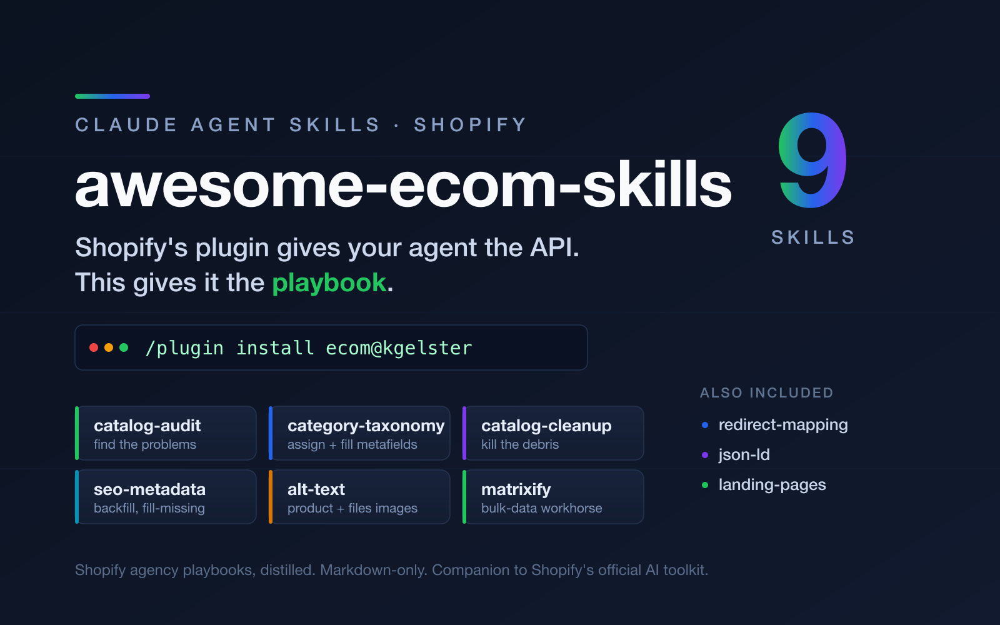

<!-- ship the cart, not the code -->

<p align="center">
  
</p>

<p align="center">
  <a href="LICENSE"></a>
  <a href="https://github.com/kgelster/awesome-ecom-skills/releases"></a>
  
  
  
</p>

<p align="center">
  <b>Shopify's plugin gives your agent the API. This gives it the playbook.</b>
</p>

> Shopify's [official AI toolkit](https://shopify.dev) hands your coding agent the Admin API — the schema, the mutations, the reference. What it doesn't hand over is *judgment*: which category ID not to guess, why a blank cell in a Matrixify import silently deletes a metafield, how to backfill SEO metadata without overwriting a human's copy, where the ghost review stars come from. This repo packages that judgment as [Agent Skills](https://agentskills.io): focused, model-readable playbooks your agent loads on demand when you point it at a real store. It's a companion to the official plugin, not a replacement — that one gives your agent the API, this gives it the playbook.

```
/plugin marketplace add kgelster/awesome-ecom-skills
/plugin install ecom@kgelster
```

## The catalog cleanup suite

The core of the repo: six skills for getting a messy catalog into shape, from finding the problems to fixing the data. They cross-reference each other — audit finds, the rest fix.

<table>
  <tr>
    <td align="center" width="33%" valign="top">
      <a href="skills/shopify-catalog-audit/SKILL.md"><b>🔎 shopify-catalog-audit</b></a><br />
      <sub>Find the problems. A cheap deterministic index plus hypothesis-driven triage over a catalog too big to read whole: missing photos, thin descriptions, pricing anomalies.</sub>
    </td>
    <td align="center" width="33%" valign="top">
      <a href="skills/shopify-category-taxonomy/SKILL.md"><b>🗂️ shopify-category-taxonomy</b></a><br />
      <sub>Assign the Standard Product Taxonomy category, then fill its category metafields. Verify IDs against the source (never guess), mint the reserved-namespace value metaobjects.</sub>
    </td>
    <td align="center" width="33%" valign="top">
      <a href="skills/shopify-catalog-cleanup/SKILL.md"><b>🧹 shopify-catalog-cleanup</b></a><br />
      <sub>Fix the debris the audit finds: bulk-archive dead products, delete the orphaned metafields behind ghost review stars, strip double-bold HTML artifacts from descriptions.</sub>
    </td>
  </tr>
  <tr>
    <td align="center" width="33%" valign="top">
      <a href="skills/shopify-seo-metadata/SKILL.md"><b>🏷️ shopify-seo-metadata</b></a><br />
      <sub>Safe-mode backfill of missing SEO titles and descriptions across products, collections, pages, and blog posts. Fill missing only, preview-first, verify via the API.</sub>
    </td>
    <td align="center" width="33%" valign="top">
      <a href="skills/shopify-alt-text/SKILL.md"><b>🖼️ shopify-alt-text</b></a><br />
      <sub>Backfill image alt text across product media and the Files library (two different mutations). Describe the image, not the sales pitch; fill missing only.</sub>
    </td>
    <td align="center" width="33%" valign="top">
      <a href="skills/shopify-matrixify/SKILL.md"><b>📦 shopify-matrixify</b></a><br />
      <sub>The bulk-data workhorse. Backup-export-first doctrine, MERGE vs REPLACE, the blank-cell-deletes-a-metafield trap, and programmatic CSV generation rules.</sub>
    </td>
  </tr>
</table>

## Also included

<table>
  <tr>
    <td align="center" width="33%" valign="top">
      <a href="skills/shopify-redirect-mapping/SKILL.md"><b>↪️ shopify-redirect-mapping</b></a><br />
      <sub>Turn a Search Console 404 export into live 301s after a migration. Recall-first matching, per-type thresholds, never silently fall back to the homepage.</sub>
    </td>
    <td align="center" width="33%" valign="top">
      <a href="skills/shopify-json-ld/SKILL.md"><b>📐 shopify-json-ld</b></a><br />
      <sub>Supplemental-only structured data: never duplicate the theme's Product schema, ship JSON-LD from a metafield + Liquid snippet, hallucination-guarded generation.</sub>
    </td>
    <td align="center" width="33%" valign="top">
      <a href="skills/ecom-landing-pages/SKILL.md"><b>🎯 ecom-landing-pages</b></a><br />
      <sub>Landing-page ideation and build blueprint: an 8-archetype angle taxonomy keyed to traffic source, 4-axis prioritization, and a 10-section page anatomy.</sub>
    </td>
  </tr>
  <tr>
    <td align="center" width="33%" valign="top">
      <a href="template/SKILL.md"><b>➕ contribute</b></a><br />
      <sub>Got a hard-won Shopify lesson? Copy the template and open a PR. Original prose, env-var secrets, preview-before-mutate, verify against ground truth.</sub>
    </td>
    <td align="center" width="33%" valign="top"></td>
    <td align="center" width="33%" valign="top"></td>
  </tr>
</table>

---

## ⚠️ Read before you install

**These skills direct an agent to mutate a live Shopify store** — archive
products, delete metafields, rewrite descriptions, create redirects. That is
exactly as powerful as it sounds.

- **Review the skills before installing.** They're plain Markdown; read what
  they'll do. Nothing here phones home or auto-runs — they're reference guides —
  but you're handing an agent a playbook for your storefront's data.
- **The recipes are preview-first and safe-mode by doctrine.** Every mutation is
  preceded by a read-only count query, safe mode fills missing / MERGEs / hides
  before it overwrites / REPLACEs / deletes, and every write is verified via an
  Admin API readback. But doctrine is not a seatbelt: **you own the store and
  the risk.** Run the preview, check the number, take a Matrixify backup export
  before a large write.
- **Never paste tokens into files.** Every skill reads the Admin API access
  token from an environment variable. Keep it there.

---

## Install

### Claude Code plugin (recommended)

```
/plugin marketplace add kgelster/awesome-ecom-skills
/plugin install ecom@kgelster
```

The nine skills activate automatically when your prompt matches (e.g. "my
Matrixify import wiped a bunch of metafields", "backfill alt text on my product
photos", "map the old URLs after my replatform").

### Manual copy (any Claude Code, no marketplace)

```bash
git clone https://github.com/kgelster/awesome-ecom-skills
cp -r awesome-ecom-skills/skills/* ~/.claude/skills/
```

Each skill directory is self-contained — copy just the ones you want.

### Other harnesses

Every `SKILL.md` is harness-neutral Markdown with standard Agent-Skills
frontmatter ([spec](https://agentskills.io/specification)). Drop the `skills/*`
directories wherever your agent framework discovers skills, or point it at this
repo.

---

## What's inside a skill

```
skills/shopify-<area>/
  SKILL.md            # the playbook (frontmatter + body, ~100-200 lines)
  references/*.md     # heavy detail — query recipes, prompts, gotchas — loaded on demand
```

There is **no `scripts/` directory** anywhere. This collection ships recipes,
not programs: the GraphQL and curl blocks are copy-and-adapt starting points
your agent runs against the current schema and discards. That keeps the skills
honest across Shopify's quarterly API changes instead of shipping a binary that
silently rots. Skills are original prose — the operational lessons agency work
teaches, not a copy of [shopify.dev](https://shopify.dev). The official docs
remain canonical for the API itself.

## Contributing

Have a hard-won Shopify lesson? Copy [`template/SKILL.md`](template/SKILL.md)
and follow its authoring notes: original prose (no docs paste), read secrets
from the environment, preview-before-mutate and safe-mode defaults, and show the
reader how to verify the change via the Admin API. PRs welcome.

## Versions tested

Distilled against **Shopify Admin API 2025-07** in July 2026. Shopify deprecates
API versions on a rolling quarterly schedule and Google changes rich-result
eligibility often — verify version-specific claims against
[shopify.dev](https://shopify.dev/docs/api/admin-graphql) and each skill's
**Provenance and maintenance** section before trusting them. When in doubt, the
Admin API readback is the source of truth, not the storefront (it's CDN-cached).

## License

MIT — see [LICENSE](LICENSE).

> Not affiliated with Shopify. "Shopify" and "Matrixify" are used descriptively;
> this is an independent, community-built collection. Client work referenced in
> these skills is anonymized.
